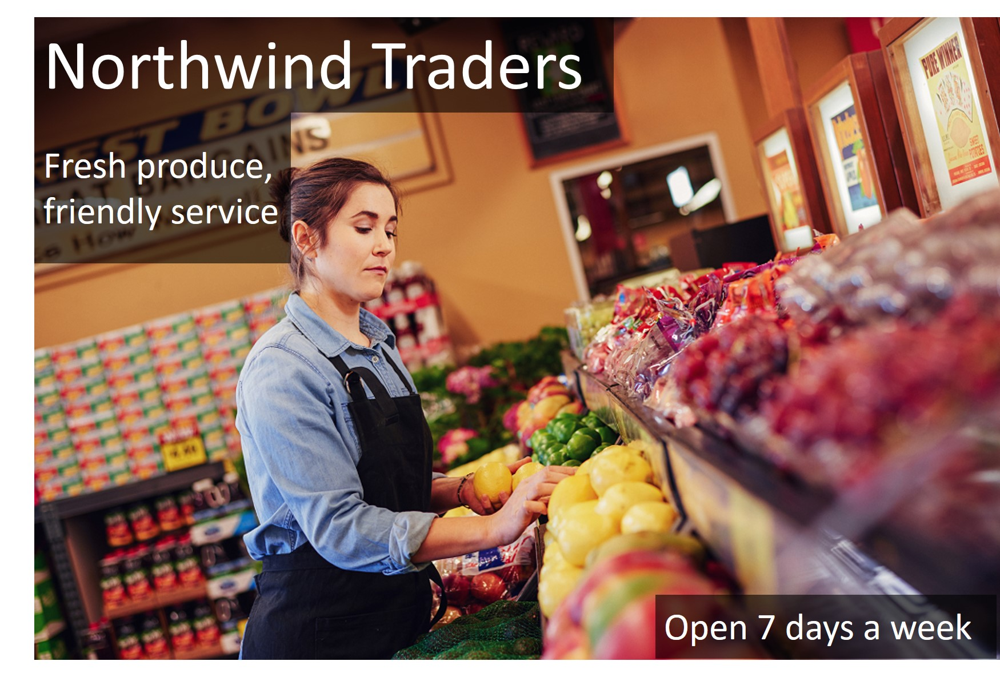

# Criando recursos de serviços de IA do AZURE para reconhcimento de face, caracteres e ojetos dentro de imagens.

## Reconhecimento de rostos humanos

### Vá no portal da [Azure](https://portal.azure.com/?azure-portal=true), criar recurso, em serviços de IA do Azure, criar, e siga as instruções dessa [Documentação](https://microsoftlearning.github.io/mslearn-ai-fundamentals/Instructions/Labs/04-face.html) para fazer seus testes.

 Nesta imagem apenas uma rosto foi detectado.

 Agora serão detectados três rostos, pois não há nenhum obstáculo que impeça a detecção.

 Devido ao obstáculo apenas um rosto foi detectado.

## Reconhecimento óptico de caracteres (OCR)

### Usaremos um recurso de serviços de IA do Azure, que inclui serviços do Azure AI Vision Studio para testar a obtenção de texto de imagens, sem escrever código algum.

Vá no portal da [Azure](https://portal.azure.com/?azure-portal=true), criar recurso, em serviços de IA do Azure, criar, e siga as instruções dessa [Documentação](https://microsoftlearning.github.io/mslearn-ai-fundamentals/Instructions/Labs/05-ocr.html) para efetuar seus testes.

 Os tributos detectados nessa imagem são Comerciantes da Northwind
VENCEDORA DA TORTA
Produtos frescos,
Serviço amigável
Aberto 7 dias por semana

 Desde que a letra seja legível é extraído textos de textos escritos a mão.

![Alt text] Lê cupons fiscais e documentos diversos

ATRIBUTOS DETECTADOS:

Comerciantes da Northwind

Rua Principal 123

555-123-4567

17/02/2020 13h07

1 maçã US$ 0,90

1 laranja US$ 0,80

Subtotal US$ 1,70

Imposto US$ 0,17

Total US$ 1,87

## Reconhecimento de objetos em imagens

###  Será utilizado o Azure AI Vision Studio para analisar imagens usando as experiências de teste integradas, inclui inúmeras capacidades para compreender o conteúdo e o contexto da imagem e extrair informações das imagens.

Vá no portal da [Azure](https://portal.azure.com/?azure-portal=true), criar recurso, em serviços de IA do Azure, criar, e siga as instruções dessa [Documentação](https://microsoftlearning.github.io/mslearn-ai-fundamentals/Instructions/Labs/03-image-analysis.html) para fazer seus testes.

Nessa imagem foi utilizado o recurso "Legenda" que é mais simples que identifica apenas ojetos.

produto

produto

produto

...

Há a opção "Legendas densas" onde são descritas objetos, pessoas  e ações como na mesma imagem:

ATRIBUTOS DETECTADOS
Uma mulher e uma menina em uma mercearia

Uma mulher sorrindo enquanto segura um telefone

Uma pessoa segurando uma capa de telefone

Uma mulher usando um chapéu roxo

Uma mulher segurando um celular para uma garota em uma loja

Uma pessoa segurando um pedaço de gengibre

Close de uma pessoa usando um chapéu roxo

Uma mulher sorrindo para um celular

Uma fileira de potes em uma prateleira

Uma imagem borrada de uma pessoa parada em uma sala

### Ainda há o recurso "Extrair Tags" que é baseado em milhares de objetos reconhecíveis, incluindo seres vivos, cenários e ações; e também o recurso "Detectar objetos comuns em imagens"

Extraindo Tags

A detecção de objetos detecta e extrai caixas delimitadoras com base em milhares de objetos e seres vivos reconhecíveis.

ATRIBUTOS DETECTADOS

Valor limiar


15
________________________________________
pessoa ( 84,80 %)

supermercado ( 51,70 %)

O controle deslizante de limite especifica que somente objetos identificados com uma pontuação de confiança ou probabilidade maior que o limite devem ser exibidos.

